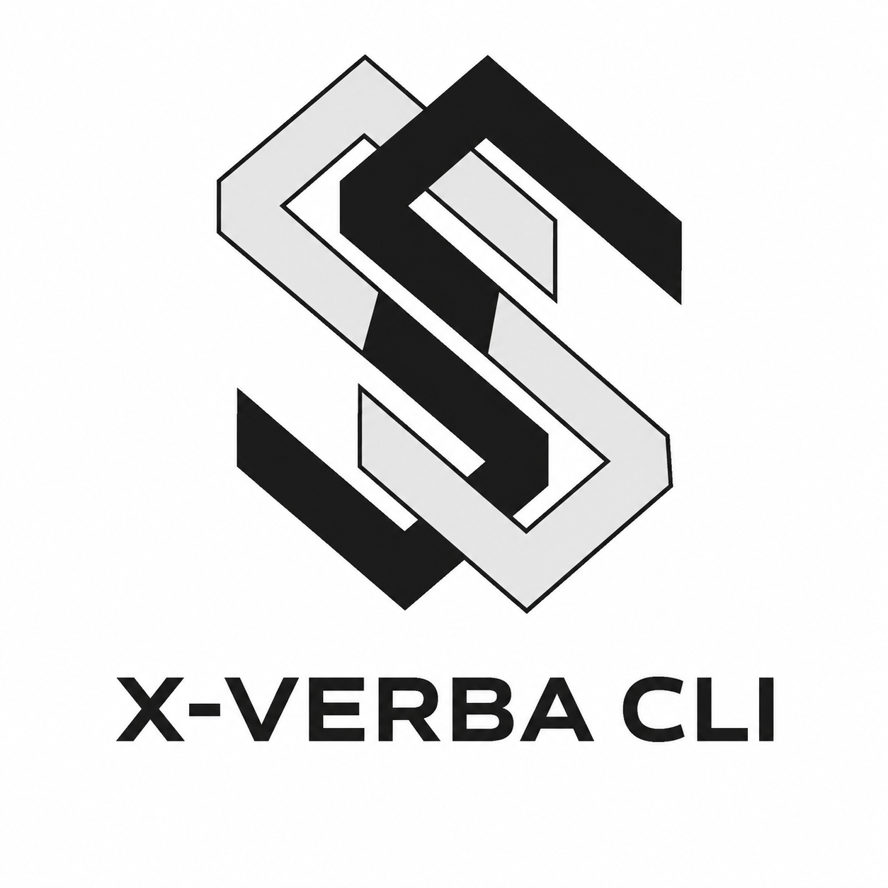
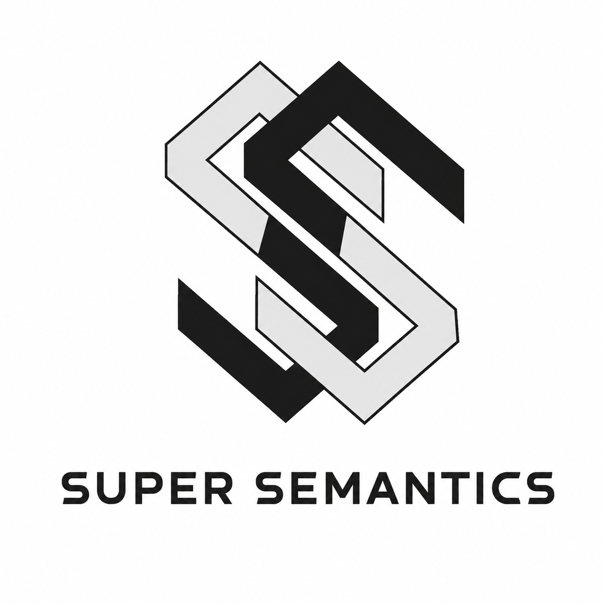

<p align="center">
  
</p>
<p align="center">
  <sub>powered by</sub><br/>
  
</p>

# X-Verba — Structural and Behavioral Governance Scanning for AI Agents

**Find the places where your code makes consequential decisions with no safeguards. Before they become failures.**

**VERBA** stands for **Verifiable Behaviour Architecture** — a research framework for making structural governance of system behaviour computable, covering governance, drift, and stabilisation in complex systems. X-Verba is the static-analysis CLI that operationalizes one part of it: it scans your codebase for **governance gaps** — places where your system commits to something irreversible (AI calls, payments, database writes, deployments, agent handovers) without adequate checks, validation, approval gates, or audit trails.

---

## What We Support

[](https://github.com/python/cpython)
[](https://github.com/tc39/ecma262)
[](https://github.com/microsoft/TypeScript)
[](https://github.com/golang/go)
[](https://github.com/rust-lang/rust)
[](https://github.com/dotnet/csharp)

### Detailed Language Support

| Language(s) | Decision points, AI-call detection, Gamma | Agent-handover detection |
|---|---|---|
| Python | ✅ Full AST-based analysis | ✅ |
| JavaScript / TypeScript (incl. JSX/TSX) | ✅ Full pattern-based analysis | ✅ |
| Go, Rust, C# | ✅ Full pattern-based analysis | — |
| Java, Ruby, PHP | ⚠️ Files counted, not analyzed — contribute nothing to Gamma, coverage, or findings | — |

### AI Provider / LLM SDK Detection

X-Verba recognizes AI calls from the official SDK of each provider below — via
import analysis in Python, call-pattern matching in JS/TS, and (as a fallback,
only when nothing else matches) a known-hostname check for raw HTTP calls with
no SDK at all.

**By default, X-Verba scans for OpenAI (including the OpenAI Agents SDK),
LangChain, and LangGraph only.** These get the most scrutiny — every
detection pattern has been audited against real confirmed false positives
(a Twilio SMS call mistaken for an Anthropic call, a NetworkX graph
mistaken for a LangGraph one, an insurance-claims "agent" object mistaken
for a LangChain agent — see [CHANGELOG](CHANGELOG.md) for the full list)
and paired with a regression test locking the fix in. Narrower scope, but
what it reports is held to a higher bar.

[](https://github.com/openai/openai-python)
[](https://github.com/openai/openai-agents-python)
[](https://github.com/langchain-ai/langchain)
[](https://github.com/langchain-ai/langgraph)

Pass `--all-frameworks` to widen detection to every provider the engine
recognises — these still have working detectors, just not (yet) held to
the same precision bar as the three above:

[](https://github.com/anthropics/anthropic-sdk-python)
[](https://github.com/googleapis/python-genai)
[](https://github.com/cohere-ai/cohere-python)
[](https://github.com/boto/boto3)
[](https://github.com/mistralai/client-python)
[](https://github.com/ppl-ai/api-discussion)
[](https://github.com/OpenRouterTeam/openrouter-runner)
[](https://github.com/xai-org/xai-sdk-python)
[](https://github.com/replicate/replicate-python)
[](https://github.com/huggingface/transformers)
[](https://github.com/meta-llama/llama-stack-client-python)

```bash
x-verba scan ./my-repo                  # OpenAI, LangChain, LangGraph only
x-verba scan ./my-repo --all-frameworks # every provider above
```

### Agentic Framework Support

X-Verba detects multi-agent **handovers** (`agent_inventory` — agents, handover
edges, chains, clusters) for the frameworks below, grouped by the structural
pattern each one uses. A framework can appear in more than one group — several
ship multiple coordination APIs in the same codebase (AutoGen and Semantic
Kernel both do). Every entry was verified against that framework's own real
source code, not inferred from documentation.

Unlike AI-provider detection above, handover detection runs on **structural
shape**, not framework identity — e.g. the graph/builder-edges group below
detects LangGraph, Microsoft Agent Framework, AutoGen, and Haystack through
one shared pattern (`add_node()`/`add_edge()`), not four separate
per-framework checks. It isn't affected by `--all-frameworks` and always
runs at full breadth, regardless of scan scope.

**Graph / builder edges** — `add_node()` / `add_edge()` (or an equivalent fluent edge-builder) declaring a directed graph of agents/steps.

[](https://github.com/langchain-ai/langgraph)
[](https://github.com/langchain-ai/langgraphjs)
[](https://github.com/microsoft/agent-framework)
[](https://github.com/deepset-ai/haystack)
[](https://github.com/microsoft/autogen)
[](https://github.com/microsoft/semantic-kernel)

**List-composition** — a constructor keyword (`agents=`, `participants=`, `sub_agents=`, `members=`) whose value is a flat list of agents.

[](https://github.com/crewAIInc/crewAI)
[](https://github.com/microsoft/autogen)
[](https://github.com/microsoft/semantic-kernel)
[](https://github.com/google/adk-python)

**Dynamic agent spawning** — a tool function recursively spawns a child instance of the same agent, bounded by a depth cap.

[](https://github.com/NousResearch/hermes-agent)
[](https://github.com/openclaw/openclaw)
[](https://github.com/omnigent-ai/omnigent)

**Protocol/server (agent-to-agent)** — a client calls a remotely, independently-deployed agent over a network boundary, no in-process call chain.

[](https://github.com/google-agentic-commerce/AP2)
[](https://github.com/crewAIInc/crewAI)
[](https://github.com/run-llama/llama-agents)

**Agent-as-tool** — a sub-agent is wrapped inside an ordinary tool definition and handed to a supervisor agent.

[](https://github.com/langchain-ai/langchainjs)
[](https://github.com/openai/openai-agents-python)
[](https://github.com/pydantic/pydantic-ai)

**Constructor-keyword handoffs** — a `handoffs=` keyword on the Agent constructor, referencing other Agent instances directly.

[](https://github.com/openai/openai-agents-python)
[](https://github.com/kyegomez/swarms)

**Named subagent registry** — a dict keyed by subagent name on a single options object; the main agent picks one at runtime by intent.

[](https://github.com/anthropics/claude-agent-sdk-python)
[](https://github.com/codeany-ai/open-agent-sdk-typescript)

**Pub/sub messaging** — a publish-style distribution method paired with a per-agent subscribe/watch filter, often split across multiple files.

[](https://github.com/FoundationAgents/MetaGPT)
[](https://github.com/microsoft/autogen)
[](https://github.com/codeany-ai/open-agent-sdk-typescript)

---

## Table of Contents

- [What It Does (In 30 Seconds)](#what-it-does-in-30-seconds)
- [Why This Matters](#why-this-matters)
  - [Scenario 1: Unvalidated Database Writes from AI](#scenario-1-unvalidated-database-writes-from-ai)
  - [Scenario 2: Agent Escalation Without Limits](#scenario-2-agent-escalation-without-limits)
  - [Scenario 3: Cluster-Level Governance Failure](#scenario-3-cluster-level-governance-failure)
  - [Scenario 4: Payment Without Approval](#scenario-4-payment-without-approval)
  - [Scenario 5: Real-World Precedent — Knight Capital](#scenario-5-real-world-precedent--knight-capital)
- [What X-Verba Scans For](#what-x-verba-scans-for)
  - [Category 1: AI Integrations](#category-1-ai-integrations)
  - [Category 2: Irreversible Actions (in AI-adjacent code)](#category-2-irreversible-actions-in-ai-adjacent-code)
  - [Category 3: Decision Points](#category-3-decision-points)
  - [Category 4: Agent Governance Gaps](#category-4-agent-governance-gaps)
  - [Category 5: Governance Mechanisms Detected](#category-5-governance-mechanisms-detected)
- [Installation](#installation)
- [Quick Start](#quick-start)
  - [1. Scan Your Repo](#1-scan-your-repo)
  - [2. Open the Report](#2-open-the-report)
  - [3. Fill in Your Governance](#3-fill-in-your-governance)
  - [4. Verify (CI/CD)](#4-verify-cicd)
- [Understanding the Gamma Score (Γ)](#understanding-the-gamma-score-γ)
- [What It Finds (Real Code Examples)](#what-it-finds-real-code-examples)
  - [Example 1: LLM Output → Database, No Validation](#example-1-llm-output--database-no-validation)
  - [Example 2: Agent Escalation Without Approval](#example-2-agent-escalation-without-approval)
  - [Example 3: Multi-Service Cluster Failure](#example-3-multi-service-cluster-failure)
  - [Example 4: Payment Without Approval Gate](#example-4-payment-without-approval-gate)
- [File Context Classification](#file-context-classification)
- [Modes](#modes)
  - [`x-verba scan`](#x-verba-scan)
  - [`x-verba qa`](#x-verba-qa)
  - [`x-verba forensics` (Not yet implemented)](#x-verba-forensics-not-yet-implemented)
  - [`x-verba prompt` (Not yet implemented)](#x-verba-prompt-not-yet-implemented)
  - [`x-verba compile` (Not yet implemented)](#x-verba-compile-not-yet-implemented)
- [Language Support](#language-support)
- [What X-Verba Does NOT Do](#what-x-verba-does-not-do)
- [Limitations (Be Honest)](#limitations-be-honest)
- [Next Steps](#next-steps)
- [Contributing](#contributing)
- [License](#license)
- [About](#about)

---

## What It Does (In 30 Seconds)

```bash
x-verba scan ./my-repo
```

X-Verba reads your code and identifies **decision points** — every location where your system commits to an irreversible action:

- LLM API calls
- Payment transactions
- Database writes / deletes
- External API calls
- File system operations
- System commands
- Agent-to-agent handovers
- Multi-agent cluster operations

For each decision point, X-Verba tells you:
- **Where** the decision happens (file, line number)
- **What** kind of decision it is (AI call? payment? database write? agent handover?)
- **Why** it matters (consequence if ungoverned)
- **What safeguards are present** (validation? approval gate? audit trail?)
- **What's missing** (Pre-Node gap analysis)
- **What to do** (specific governance fix)

Output: A YAML template you fill in with your governance rules.

---

## Why This Matters

### Scenario 1: Unvalidated Database Writes from AI
```python
user_input = request.args.get('data')
response = claude_api.messages.create(
    model="claude-3-5-sonnet",
    messages=[{"role": "user", "content": f"Process: {user_input}"}]
)
# No validation here
db.users.update_one(
    {"id": user_id},
    {"$set": response.content}  # ← AI output → database, no check
)
```

**Risk:** AI hallucination or injection attack corrupts your database. Once written, corruption propagates to downstream systems.

**What X-Verba finds:** 
```
FINDING: AI output flows directly to database write
Status: UNGOVERNED
Gap: No validation between LLM output and db.update()
Fix: Add validation, schema check, approval gate
```

---

### Scenario 2: Agent Escalation Without Limits
```python
def autonomous_system(objective):
    while not done:
        next_step = agent.decide(objective)  # Agent decides what to do
        
        if next_step == "read_file":
            content = open(file_path).read()  # File read OK
        elif next_step == "write_file":
            open(file_path, "w").write(data)  # File write — no approval
        elif next_step == "run_command":
            subprocess.run(cmd)  # System command — no depth limit
        elif next_step == "query_database":
            db.execute(query)  # Database — no validation
```

**Risk:** Agent escalates from read-only to file writes to system commands. No circuit breaker. No human gate. No depth limit.

**What X-Verba finds:**
```
FINDING: Agent escalation chain with no depth limit
Status: CRITICAL GOVERNANCE GAP
Details: 
  - Line 45: file read (low risk)
  - Line 48: file write (medium risk, ungoverned)
  - Line 51: subprocess.run (high risk, ungoverned)
  - Line 54: db.execute (high risk, ungoverned)
Gap: No circuit breaker after N steps
Fix: Add depth limit, human gate, audit trail
```

---

### Scenario 3: Cluster-Level Governance Failure
```python
# Service 1: LLM-driven recommendations
def recommendation_service(user_id):
    recommendation = claude.generate_recommendation(user)
    cache.set(f"rec:{user_id}", recommendation)  # ← Stored in cache
    return recommendation

# Service 2: Approval workflow
def approval_service(user_id):
    recommendation = cache.get(f"rec:{user_id}")  # ← Retrieved from cache
    # No validation that this came from a trusted source
    # No check that the recommendation is still valid
    payment.process(recommendation.amount)  # ← Potentially corrupted data

# Service 3: Notification
def notify_service(user_id):
    rec = cache.get(f"rec:{user_id}")
    send_email(user, rec.message)  # Uses potentially corrupted data
```

**Risk:** Service 1's LLM output is unvalidated. Service 2 retrieves it and uses it for payments. Service 3 propagates it further. Each service individually looks fine. The cluster produces cascade failures.

**What X-Verba finds:**
```
FINDING: Multi-agent cluster governance gap
Status: CRITICAL
Details:
  - Service 1 → Cache: no validation before store
  - Service 2 → Payment: retrieves unvalidated data
  - Service 3 → Email: propagates unvalidated data
Gap: No cluster-level invariant (recommendation must be validated)
Fix: Add cross-service validation, audit trail, consistency checks
```

---

### Scenario 4: Payment Without Approval
```python
def process_refund(refund_request):
    amount = refund_request.get("amount")  # User-supplied
    reason = refund_request.get("reason")   # User-supplied
    
    # No validation of amount
    # No approval gate
    stripe.charge.create(
        amount=amount,
        customer=customer_id,
        description=reason
    )
```

**Risk:** Attacker requests arbitrarily large refund. No approval required. Payment processes immediately.

**What X-Verba finds:**
```
FINDING: Payment operation with no approval gate
Status: CRITICAL
Details:
  - User input flows directly to payment amount
  - No approval mechanism
  - No audit trail
Gap: Missing Pre-Node (approval gate before stripe.charge)
Fix: Require human approval before any payment > threshold
```

---

### Scenario 5: Real-World Precedent — Knight Capital
**August 1, 2012.** Knight Capital Group lost **$440 million in 45 minutes.**

A legacy trading algorithm was accidentally reactivated. The reactivation happened because:
1. A deployment flag enabled dormant code
2. **No eligibility check** before activation
3. **No boundary enforcement** to confirm prior deactivations
4. Once activated, the algorithm executed autonomously with full privileges
5. Irreversible financial trades executed in milliseconds

**What X-Verba would have found:**

```
CRITICAL FINDING:
  Location: order_routing/power_peg.py:247
  Issue: Irreversible action (trade execution) with no Pre-Node
  
  Details:
    - Function: execute_trades()
    - Trigger: deployment_config.power_peg_enabled == True
    - Consequence: Immediate live trading, no human approval
    - Risk: Reactivates legacy code without eligibility check
  
  Gap: Missing Pre-Node
    - What's needed: Verification that prior deactivations are complete
    - What's needed: Human authorisation before activation
    - What's needed: Audit trail of every activation/deactivation
  
  Stabilisation Operator: SO-1 Boundary Enforcement
    - Implement: Explicit eligibility condition before activation
    - Implement: Human approval checkpoint
    - Implement: Audit log immutable record

Estimated impact if ignored: Entire company, 45 minutes.
```

One finding. One governance rule. Asked on July 31 would have cost nothing. Cost of not asking: $440 million.

---

## What X-Verba Scans For

### Category 1: AI Integrations
- LLM API calls (OpenAI, Anthropic, Google, Cohere, etc.)
- Agent frameworks (CrewAI, AutoGen, LangChain, LangGraph)
- Unvalidated input flowing into LLM prompts
- LLM output used without validation in downstream systems

### Category 2: Irreversible Actions (in AI-adjacent code)
- **Payments** — `stripe.charge`, `payment.create`, `transaction.create`
- **Database writes** — `db.insert`, `db.update`, `db.save`, `collection.insert`, SQL `INSERT`, `UPDATE`
- **Database deletes** — `db.delete`, `collection.drop`, SQL `DELETE`
- **Email** — `send_mail`, `smtp.sendmail`, `sendgrid`, `mailgun`
- **External APIs** — `requests.post`, `requests.put`, `requests.delete`, `httpx.*`, `fetch()`
- **File system** — `os.remove`, `os.unlink`, `shutil.rmtree`, file write in critical paths
- **System commands** — `os.system`, `subprocess.run`, `subprocess.Popen`, `subprocess.call`
- **Deployments** — `kubectl apply`, `docker push`, `release()`

### Category 3: Decision Points
- Conditional branches (if/elif/else)
- Loops (for/while)
- Error handling (try/except blocks)
- Function calls to consequential systems
- Agent invocations and handovers

### Category 4: Agent Governance Gaps
- **Agent-to-agent handovers** — Data from one agent becomes input to another without validation
- **Agent escalation chains** — Agent calls increasingly privileged operations (read → write → system)
- **Depth-unlimited recursion** — Agent invokes itself or other agents with no depth limit
- **Cluster-level failures** — Multiple agents individually governed, but their interactions produce inadmissible outcomes

### Category 5: Governance Mechanisms Detected
X-Verba looks for safeguards you've already built:
- **Validation functions** — Checks before irreversible actions
- **Approval gates** — Human approval required for high-risk operations
- **Authorization checks** — Permission verification before execution
- **Schema validation** — Pydantic, JSON Schema, TypeScript typing
- **Decorator-based guards** — `@require_auth`, `@validate_input`
- **Dependency injection** — FastAPI `Depends()`, `Security()` guards
- **Allow/deny lists** — Whitelisting permitted operations
- **Audit trails** — Logging consequential decisions
- **Circuit breakers** — Stopping escalation after N steps

---

## Installation

```bash
pip install x-verba        # Python 3.10+
```

---

## Quick Start

### 1. Scan Your Repo
```bash
x-verba scan ./my-repo
```

Output:
```
✓ Reading code structure...
✓ Detecting decision points...
✓ Classifying decision types...
✓ Scanning for governance mechanisms...
✓ Mapping governance gaps...
✓ Computing Gamma score...

→ Output: .verba/governance.yaml
→ Critical findings: 8
→ High findings: 12
→ Medium findings: 7
→ Structural Gamma (Γ): 0.35 / 1.0
  (35% of decision points have governance safeguards)
```

### 2. Open the Report
```bash
cat .verba/governance.yaml
```

You'll see every decision point with:
- **What type of decision** (AI call? payment? database write? agent handover?)
- **Where it happens** (file, line, code context)
- **Why it matters** (consequence if ungoverned)
- **What's present** (existing safeguards)
- **What's missing** (gaps)
- **What to do** (specific governance fix)

### 3. Fill in Your Governance
For each critical or high finding, decide: **What boundary must you enforce here?**

```yaml
decision_001:
  type: "payment_operation"
  location: "billing.py:247"
  description: "Stripe charge for user-requested refund"
  
  current_state: "UNGOVERNED"
  
  your_policy: |
    Before executing any refund:
    1. Validate amount matches a prior transaction
    2. Check refund total for this customer < $1000/day
    3. Require explicit human approval for amount > $500
    4. Log transaction with approver ID
    5. Send confirmation email after execution
```

### 4. Verify (CI/CD)
First, save a baseline once you're happy with the current state:
```bash
x-verba scan . --save-baseline
```
Then, on every subsequent commit, check for regressions against it:
```bash
x-verba qa . --schema .verba/governance-baseline.json
```
(`--fail-on-critical` is on by default, so the build already fails on critical
regressions without needing an extra flag.)

Fails your build if:
- New ungoverned decision points are introduced
- Governance strength drops below threshold
- Agent escalation chains become longer
- Critical findings increase

**GitHub Actions:**
```yaml
- name: Governance regression check
  run: x-verba qa . --schema .verba/governance-baseline.json
```

---

## Understanding the Gamma Score (Γ)

**Γ = Governed Decision Points / Total Decision Points**

- **Γ = 1.0** — Every decision is safeguarded
- **Γ = 0.75** — 75% of decisions have governance
- **Γ = 0.5** — Half your decisions are unprotected
- **Γ = 0.0** — No governance detected anywhere

**Safe default:** Γ ≥ 0.9

**What Γ measures:** Structural preparedness. Does your code have governance mechanisms in place? 

**What Γ does NOT measure:** 
- Runtime behavior (static analysis only)
- Whether governance actually *works* (that's runtime verification)
- Whether policies are sensible (you decide that)
- Compliance with regulations (governance is necessary but not sufficient)

Think of Γ as a "hygiene check" — like a linter for governance. A high Γ means you're prepared. A low Γ means you're exposed.

---

## What It Finds (Real Code Examples)

### Example 1: LLM Output → Database, No Validation
```python
# User provides a structure, we ask Claude to fill it in
user_data = request.json
response = client.messages.create(
    model="claude-3-5-sonnet",
    messages=[
        {"role": "user", "content": f"Fill this structure: {user_data}"}
    ]
)
# No validation of response before writing
db.records.insert_one({
    "user_id": user_id,
    "data": response.content  # ← Ungoverned write
})
```

**Finding:**
```
Decision Point: Database write
Type: Data from AI → Database
Location: app.py:247

Current Governance: UNGOVERNED
  - No validation between LLM response and database
  - No schema check on the data structure
  - No audit trail of what was written

Consequence: 
  - AI hallucinations corrupt your database
  - Corrupted data propagates to downstream systems
  - No way to trace the source of the corruption

Recommended Fix (SO-1 Boundary Enforcement):
  1. Validate response against schema before write
  2. Check that all required fields are present
  3. Verify no SQL injection / data corruption patterns
  4. Log the write with timestamp and LLM version
  5. Only write if validation passes
```

---

### Example 2: Agent Escalation Without Approval
```python
def autonomous_research(objective):
    agent = Agent(objective)
    while not done:
        decision = agent.decide()  # What should I do next?
        
        if decision == "read_docs":
            content = read_file(path)  # Safe, read-only
        elif decision == "write_analysis":
            write_file("analysis.txt", content)  # File write, no approval
        elif decision == "update_database":
            db.analysis.insert_one({...})  # DB write, no validation
        elif decision == "run_experiment":
            subprocess.run(cmd)  # System command, UNGOVERNED
```

**Finding:**
```
Decision Type: Agent Escalation Chain
Location: research.py:150-180

Agent-to-System Escalation Sequence:
  1. Read file (line 155) — LOW RISK, read-only
  2. Write file (line 157) — MEDIUM RISK, ungoverned
  3. Database insert (line 159) — HIGH RISK, no validation
  4. System command (line 161) — CRITICAL RISK, no depth limit

Current Governance: PARTIALLY GOVERNED
  - File read: no safeguard needed, read-only
  - File write: no approval gate, no audit trail
  - Database: no schema validation, no approval
  - System commands: NO CIRCUIT BREAKER, runs indefinitely

Consequence:
  - Agent can escalate from harmless read to dangerous system calls
  - No human oversight of escalation decision
  - No limit to how many operations can execute
  - Runaway loops possible (while loop with no exit)

Recommended Fix (SO-4 Attractor Disruption + SO-1 Boundary Enforcement):
  1. Add max_depth limit (e.g., max 5 decisions per session)
  2. Require human approval for write/system operations
  3. Separate write-only and system-call agents
  4. Add circuit breaker after 3 consecutive high-risk decisions
  5. Log every agent decision for audit trail
```

---

### Example 3: Multi-Service Cluster Failure
```python
# Service 1: Recommendation
def recommend(user_id):
    analysis = claude_api.messages.create(
        model="claude-3-5-sonnet",
        messages=[{"role": "user", "content": f"Recommend for {user_id}"}]
    )
    # No validation, but analysis is stored for other services to use
    cache.set(f"recommendation:{user_id}", analysis.content)

# Service 2: Approval (called by different team)
def approve_recommendation(user_id):
    # Retrieves recommendation from cache
    recommendation = cache.get(f"recommendation:{user_id}")
    # No validation that this came from a trusted source
    # No check that it's still valid
    
    # Uses it directly
    approve_payment(
        user_id=user_id,
        amount=recommendation.amount
    )

# Service 3: Notification
def notify_user(user_id):
    rec = cache.get(f"recommendation:{user_id}")
    send_email(user_id, rec.message)  # Could be corrupted
```

**Finding:**
```
Decision Type: Cluster-Level Governance Gap
Services Involved: 3 (recommend, approve, notify)

Flow:
  Service 1 → Cache (unvalidated write)
  Cache → Service 2 (unvalidated read)
  Service 2 → Payment (unvalidated operation)
  Cache → Service 3 (unvalidated read)

Individual Service Status:
  ✓ Service 1: Has SOME governance (API call)
  ✓ Service 2: Has SOME governance (approval logic)
  ✓ Service 3: Has governance (logging)

Cluster-Level Status: UNGOVERNED
  - No validation between services
  - Recommendation crosses service boundary unvalidated
  - Corruption in Service 1 propagates through Service 2 and 3
  - No cluster-level invariant: "recommendation must be validated"

Consequence:
  - Service 1 hallucination → corrupts cache
  - Service 2 uses corrupted data → approves bad payment
  - Service 3 propagates corruption → user gets wrong message
  - Each service individually looks fine; cluster fails silently

Recommended Fix (SO-3 Distributional Rebalancing + SO-5 Coherence):
  1. Add validation when storing to cache
  2. Add timestamp to cached recommendation
  3. Service 2 validates before using from cache
  4. Service 2 checks recommendation is < 1 hour old
  5. Service 3 validates message content before sending
  6. Cross-service audit trail (log which service validated what)
```

---

### Example 4: Payment Without Approval Gate
```python
def process_refund():
    refund_amount = request.json.get("amount")
    refund_reason = request.json.get("reason")
    
    # No validation of amount
    # No approval gate
    # Directly hits payment processor
    stripe.Charge.create(
        amount=refund_amount,
        customer=customer_id,
        reason=refund_reason
    )
    return {"status": "refunded", "amount": refund_amount}
```

**Finding:**
```
Decision Point: Payment Operation
Type: Refund Processing
Location: payments.py:312

Current State: UNGOVERNED
  - User-supplied amount used directly
  - No approval gate
  - No limit checking
  - No audit trail

Consequence:
  - Attacker requests refund for $1,000,000
  - Payment processes immediately
  - No human review required

Recommended Fix (SO-1 Boundary Enforcement):
  1. Validate amount <= original transaction
  2. Add refund limit: max $500 per refund, $2000 per customer per day
  3. Require human approval for amount > $100
  4. Generate audit trail with approver ID and timestamp
  5. Send confirmation to customer before processing
```

---

## File Context Classification

X-Verba classifies files as:
- **Framework** — Setup, configuration, scaffolding (lower governance bar)
- **Test** — Testing code (independent governance rules)
- **Application** — Core logic where governance matters most (highest bar)

The same gap in a test file is treated differently from the same gap in production code.

---

## Modes

### `x-verba scan`
Scan and generate governance report.

```bash
x-verba scan ./my-repo
x-verba scan ./my-repo --format json
x-verba scan ./my-repo --identity-key my-system-v1.0
x-verba scan ./my-repo --focus src/critical/
x-verba scan ./my-repo --all-frameworks  # widen beyond OpenAI/LangChain/LangGraph
```

### `x-verba qa`
Governance regression testing for CI/CD.

```bash
x-verba qa . --schema .verba/governance-baseline.json
```

Fails if Gamma drops or new gaps appear.

### `x-verba forensics` (Not yet implemented)
Reverse-engineer failures using the DC taxonomy.

### `x-verba prompt` (Not yet implemented)
Generate governance-informed prompts for AI coding tools.

### `x-verba compile` (Not yet implemented)
Compile governance spec into executable bundle.

---

## Language Support

For the detailed per-language breakdown of what gets full analysis vs. what's
just counted, see [Language Support](#detailed-language-support) below.

## What X-Verba Does NOT Do

1. **Runtime Enforcement** — X-Verba finds gaps. The VERBA Runtime enforces them. (Separate project)
2. **Runtime Monitoring** — Static analysis only. Can't measure actual behavior.
3. **Compliance Guarantee** — Governance is necessary but not sufficient for compliance.
4. **Security Scanning** — Not a replacement for SAST/DAST tools.
5. **Performance Analysis** — Only governance, not performance.

---

## Limitations (Be Honest)

1. **Structural Analysis Only** — X-Verba reads code. It cannot detect runtime behavior, social engineering, or human error.

2. **Language Coverage** — Java, Ruby, and PHP files are scanned but get no decision-point or AI-call detection at all, not just reduced confidence on custom wrappers. A repo mostly in one of these languages will show near-zero findings regardless of its actual governance posture — check the scan's language coverage warning before trusting a low Gamma score on such a repo. Python (AST-based) has the highest detection confidence; JavaScript/TypeScript, Go, Rust, and C# (all pattern-based) are next.

3. **False Positives** — X-Verba is deliberately sensitive. You may see governance recommendations for low-risk code. Filter by severity.

4. **Decision-Making Required** — X-Verba tells you where the gaps are. You decide what governance makes sense for your context.

5. **Not a Validator** — Finding a governance gap ≠ actual vulnerability. You must validate and make the call.

6. **Some directories are skipped by default** — `examples/`, `tests/`, `test/`, `docs/`, `cookbook/`, `demos/`, `samples/`, `benchmarks/`, `fixtures/`, `mocks/`, `notebooks/`, `tutorials/`, and a few build/dependency folders (`node_modules/`, `.venv/`, `dist/`, `build/`, etc.) are never scanned, on the assumption that they aren't production code. This is usually what you want — but it means scanning a *library's own repository* (rather than a project that *uses* that library) can under-report or show zero findings, since a library's real usage demonstrations typically live in its `examples/` folder, not in its own implementation source. If you need to scan one of these directories anyway, point `--focus` directly at it (e.g. `x-verba scan . --focus examples/`) — `--focus` always overrides the default skip list.

---

## Next Steps

1. **Run it.** `x-verba scan ./my-repo` takes 30 seconds.
2. **Read one finding.** Open the YAML. Pick the highest-severity issue.
3. **Decide your policy.** "What must be true before this decision happens?"
4. **Implement.** Add the governance mechanism (validation, approval, audit trail).
5. **Verify.** Run `x-verba qa . --schema .verba/governance-baseline.json` in your CI/CD pipeline.
6. **Track progress.** Watch Gamma increase over time as you add governance.

---

## Contributing

Issues, questions, and PRs welcome.

The most valuable contribution: **Point X-Verba at a real-world incident.** Share a post-mortem, CVE, or documented failure. We'll analyze which governance gap would have prevented it and add it to our detection library.

---

## License

MIT. Use it, fork it, embed it, commercialize it. No restrictions.

The DC taxonomy, Stabilisation Operators, and Verbanatomy framework are published under Creative Commons Attribution 4.0. X-Verba's implementation is the work of Super Semantics, licensed MIT.

---

## About

Built by **Super Semantics** — governance infrastructure for software systems.

**Governance proven, not claimed.**

X-Verba operationalizes concepts from independent research on governance, drift, and stabilisation in complex systems. Four papers published open-access on Zenodo:

- Paper 1: Pre-Stabilisation Dynamics
- Paper 2: Unified Formalism for Constraint-Driven Convergence
- Paper 3: Pre-Stabilisation Signals
- Paper 4: VERBA — Verifiable Behaviour Architecture

The research is independent. The implementation is open-source. Read both. Challenge both. Improve both.

github.com/4vish/x-verba

